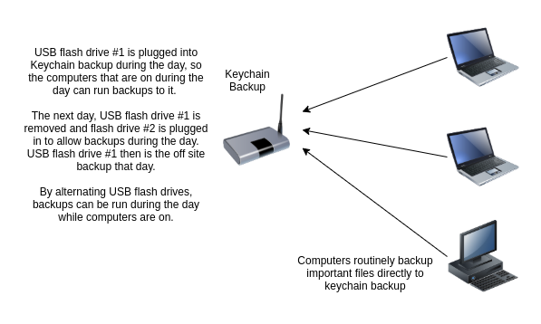

# keychainbackup

<a href="https://www.tindie.com/stores/thinklearndo/?ref=offsite_badges&utm_source=sellers_thinklearndo&utm_medium=badges&utm_campaign=badge_large"></a>

## What is keychainbackup?

Keychain backup is a simple device to create encrypted backups of your files that you take with you on your keychain! Think of it as an offsite backup of your important files, that is always with you. With the added benfit of not having to pay monthly fees.


## Example setups

Here's some examples of how to use keychain backup. Personally, I have a linux server that acts as a backup server. My important files from my other computers get backed up to it, then every night it backs up the changed files to the keychain backup. I have it scheduled to stop running the backup early in the morning, to make sure that the USB flash drive can be removed safely.


Another idea I had was to alternate USB flash drives. That would allow backups to run during the day without an extra backup server.



## Getting Started

### Raspberry Pi Version

JUN 16 2022 - Still a work in progress. These steps should work to get you setup but there may be bugs! John

### Hardware Setup

Items needed:

1x printed out case - get it [here](case/raspberry_pi_case.stl)

4x m2.5 5mm screws (for mounting the raspberry pi in the case)

3x cup hooks (I used 1.25" Hillman Cup hooks)

2x #8 2.5" screws (for mounting on the wall)

2x drywall screw holders (also for mounting on the wall)

Drill with 1/4" drill bit (for the drywall holder screw holes)

1x Raspberry Pi, setup to connect to your wifi + its power stuff

USB Drive formatted with EXT4 for backing up to.

1. Place the Raspberry Pi in the case and screw it in with the 4x m2.5 screws.


2. Screw in the cup hooks to the bottom of the case.


3. Using the case as a guide, drill out 1/4" holes and mount the case with the 2x #8 screws.


4. Plug in the power stuff for the Raspberry Pi and let it turn on.
5. Plug in your USB drive.


### Software Setup

**PLEASE NOTE: This will delete all data on your USB drive!**

1. Remote into the Raspberry Pi using SSH and install cryptsetup: ```sudo apt update``` and ```sudo apt install cryptsetup```
2. Find the device name for your USB drive, run ```mount``` and make note of the ```/dev/sdX``` that represents your USB drive.
3. Run fdisk on that device: ```fdisk /dev/sdX```
4. Delete everything on there: type ```d``` enter then ```n``` enter, and accept all the defaults. Then type ```w``` and press enter.
5. Then setup encryption on that partition, run ```cryptsetup luksFormat /dev/sdX1```, accept the warning by typing in an upppercase ```YES``` and press enter.
6. Enter a password for this encrypted partition, don't forget it!
7. Once that finishes, make a directory to mount the encrypted device at: ```sudo mkdir /mnt/container```
8. create a key to mount the container on boot: ```sudo dd if=/dev/random bs=32 count=1 of=/root/lukskey```
9. Add that key to your encrypted container: ```sudo cryptsetup luksAddKey /dev/sdX1 /root/lukskey```. Enter the container password you setup.
10. Get the UUID for your encrypted parition, run ```sudo blkid``` and find the UUID associated with your encrypted container, you'll need this to setup crypttab.
11. Edit your ```/etc/crypttab``` file with your favorite editor and add this: ```container UUID=<uuid from previous step> /root/lukskey luks```, save and exit
12. Edit your ```/etc/fstab``` file with your favorite editor and add this: ```/dev/mapper/container   /mnt/container  ext4    defaults,nofail,x-systemd.automount 0 0```, save and exit
13. Reboot and verify that the USB drive is automatically mounted on ```/mnt/container```

At this point the Raspberry Pi is setup to automatically mount the encrypted USB device when it is plugged in. Next setup your backup software to backup to the USB device. A howto will be coming shortly!


### Omega2+ version

### Hardware setup

### Items needed: Phillips screwdriver, 1/4" drill bit, drill, anti static wrist strap, and an Omega2+.
 1. Place the circuit board on the case and screw in the 4 m3 screws.

 

 

 2. Screw in the hooks into the diamond holes on the bottom of the case.

 

 

 3. Insert the Omega2+ into the headers on the circuit board.

 
 
 4. To mount the device on the wall, drill two 1/4" holes, using the case as a guide. Insert the blue drywall hangars into the holes. Then use the provided silver screws to screw the case to the wall.

 
 
 5. Insert the USB drive into the USB port. <b>NOTE: The initial setup will erase all files on the USB drive!</b>
 
 6. Plug in the micro usb connector on the circuit board, then insert the other end into the power brick and plug it in to power on the device.

 


## Software Setup

 1. Go through Omega setup, [https://docs.onion.io/omega2-docs/first-time-setup.html](https://docs.onion.io/omega2-docs/first-time-setup.html)
 2. Start the Setup app. [Get it here!](https://github.com/johneast2/keychainbackup/releases/tag/V1.1)
 3. Enter the Omega2+'s Ip address.
 
 4. Set a new SSH password the Omega2+.
 
 6. Set the password that will be used for the encrypted storage container.
 
 7. If you want to use Syncthing, click advanced, then make sure Install Syncthing checkbox is checked.
 8. Click setup device.
 9. You will need to click the warning button about all files being deleted from the USB drive.
 10. Once setup finishes, the encrypted storage container will be mounted at /tmp/container on the Omega2+.

With the keychain backup device setup, next is setting up a backup program to backup to it. Any backup program that can send data to an SSH host should be able to work with keychain backup. [Here's an example using a free, open source program](docs/SettingUpBackups.md)

Keychain Backup now supports Syncthing! For info on setting it up, check out the [Syncthing Documentation!](docs/SettingUpSyncthing.md)

## Limitations

While this is a cool backup device, there are some limitations to be aware of. It's mostly designed to be used as a cold storage type device, where data is backed up to it that isn't changing often.

1. Backup speed is not fast. The fastest I've been able to backup data to it is about 1GB in 15 minutes. Assuming 1GB every 15 minutes, if the device is plugged in over night for 8 hours, it could backup 32GB.
2. Its backing up on a solid state USB device. Backing up constantly changing data will probably shorten the lifetime of the USB device.
3. The encryption key is stored on the device on your wall. If someone gets access to it, they will be able to decrypt all the data on the USB device. The encryption is designed to prevent some random person from viewing your photos and it probably won't stop someone who is determined to get access to it.

## File Recovery.

For information on recovering files from the USB drive, [see this document.](docs/RecoveringFiles.md)

## Building the manager app

You will need nodjes and npm isntalled.

Install electron-packager: ```npm install --save-dev electron-packager```

Then to build it for windows: ```npx electron-packager manageApp/ keybackupmanager --platform=win32 --arch=x64```
