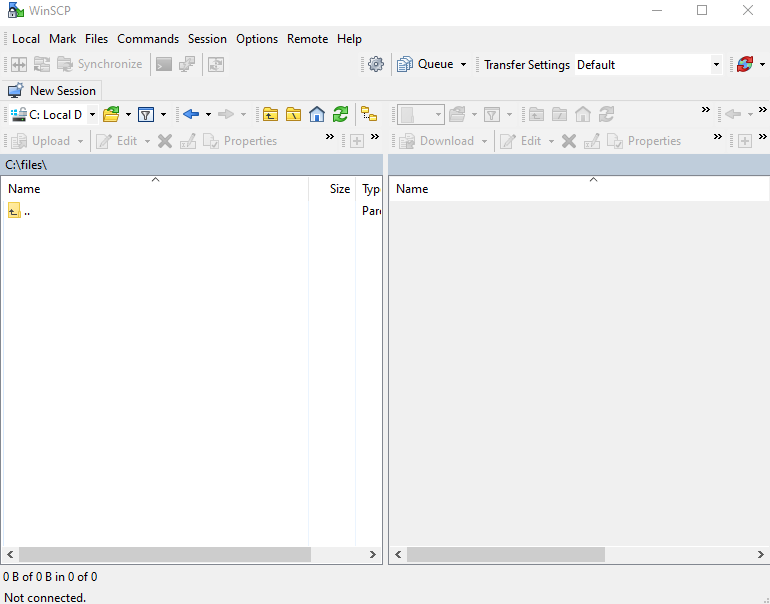
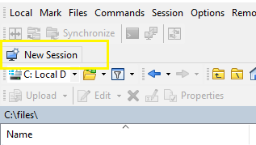
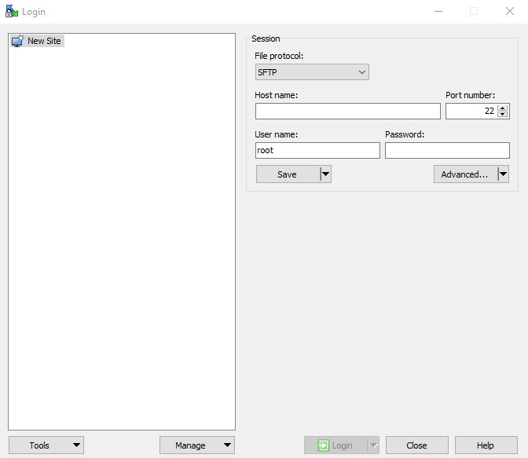
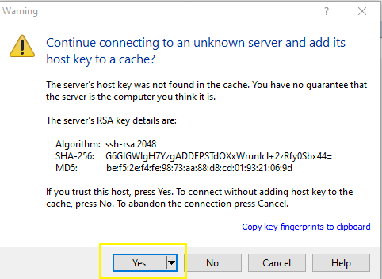
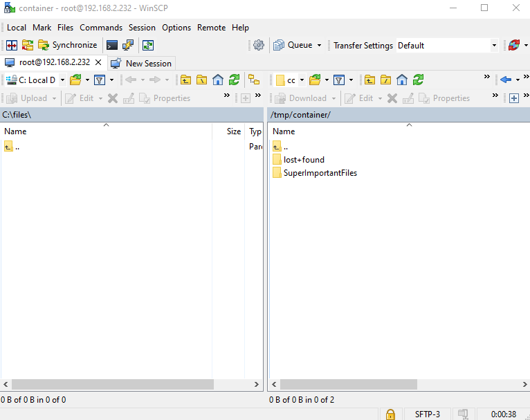
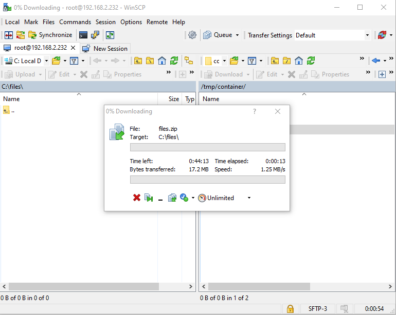

# Recovering Files Using WinSCP

Because of how the files are encrypted on the USB Drive, simply popping it into the USB port of your Windows computer will not work. Here are the steps to use WinSCP to copy off your backup files from the USB drive.

  1. Plug the USB drive into the Omega2+. Make sure the Omega2+ is powered on.
  2. Download WinSCP from here: [WinSCP Download page](https://winscp.net/eng/download.php) and install it.
  3. Open WinSCP, you'll see this window on startup:
  
  3. Click on the New Session button:

  
  
  4. The New session screen will appear. In the Host Name field, enter the ip address of the Omega2+. Port Number leave at 22. The Username is root and the Password is the SSH password that was entered at setup.
  
  
  
  5. Click the login button. If this is the first time connecting to the omega2+, you will get a warning about adding an unknown servers key, its ok. Click on the Yes button.
  
  
  
  6. After successfully connecting, the window will show the files on the Omega2+ on the right window pane. The left window pane is the local computer files.
  7. In the right window pane, double click on the encrypted_container folder to access the backed up files on the Omega2+. 
  8. To copy the files back to the local computer, drag the folders/files from the right pane to the left pane. For example, In the following picture, it shows the folder SuperImportantFiles. To download that folder to my computer, I would select that folder then drag it over into the right window pane.
  
  
  
  Then a window will show up, showing the progress of the copy.
  
  
  
  9. Once the copy operation has finished, the files are available on the local computer.
