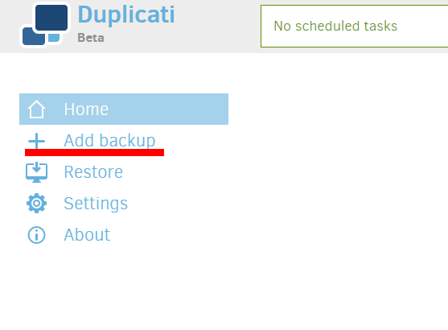
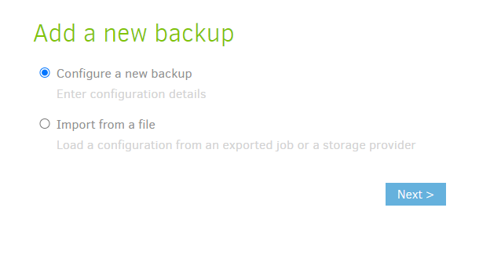
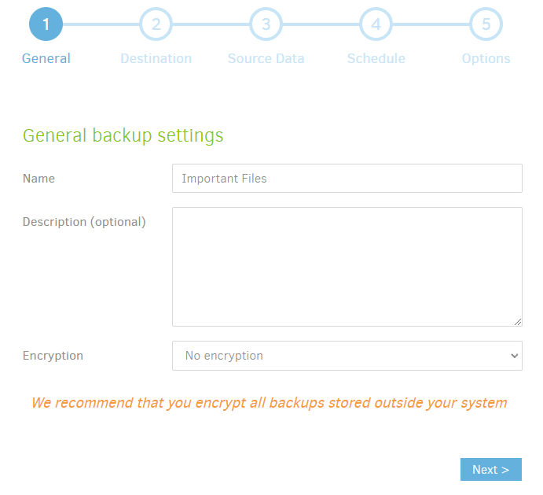
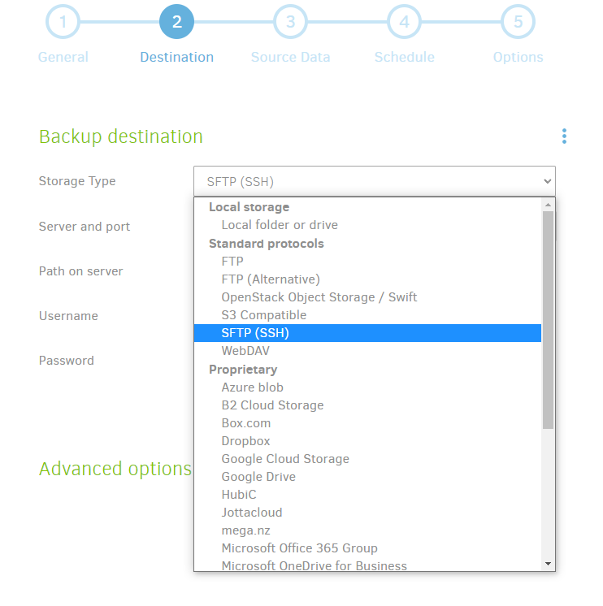
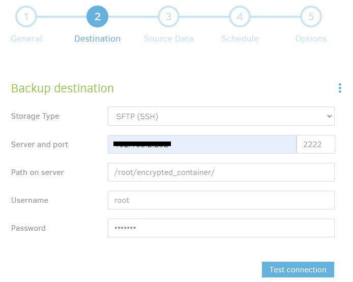
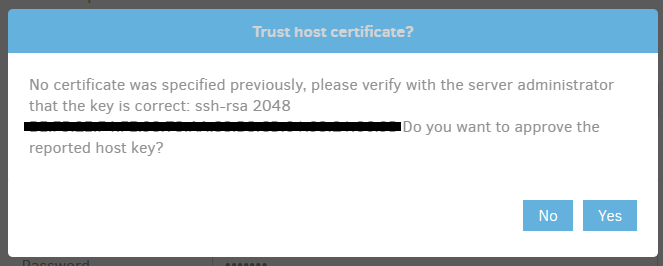
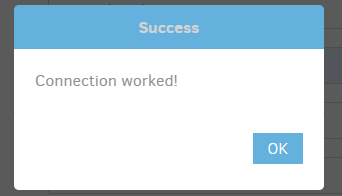
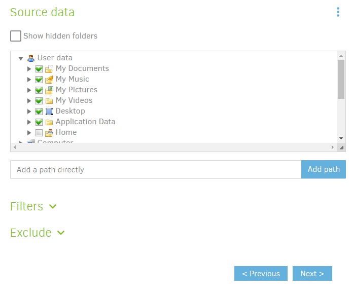
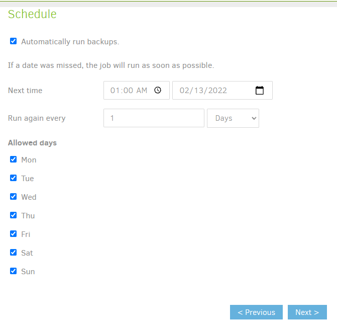
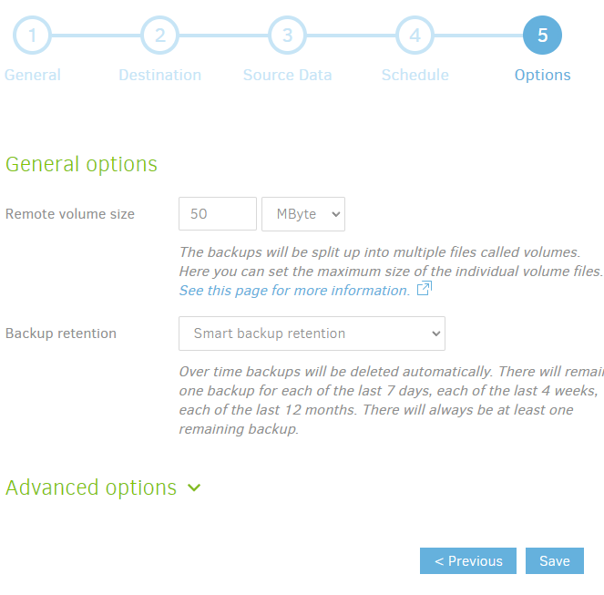

# Setting up backups with Duplicati to Keychain Backup

Duplicati is a free, opensource backup application, avaible for Windows, Linux and MacOS. It supports connecing to SSH hosts, and scheduling backups, among other features.

1. Download Duplicati and install it. Download from here: [Duplicati 2.0](https://www.duplicati.com/download)

2. Open Duplicati by double clicking on the Duplicati 2 Desktop icon or by right clicking on the tray icon and selecting Open

3. At the Duplicati main window click Add Backup on the left side of the window.



4. At the Add a new backup screen make sure Configure a new backup is selected, then click Next.



5. At the General backup settings screen, give the backup a descriptive name. Then set Encryption to No encryption. Because all files backed up on the keychain backup device are encrypted already, duplicati's encryption is unnecessary. Click Next to continue.



6. At the Backup destination screen, change Storage Type to ```SFTP(SSH)```



7. Enter the ip address of your keychain backup device, then enter ```2222``` for the Port. 
8. For Path on server enter ```/root/encrypted_container/```
9. For Username, enter ```root```
10. For Password, enter the password you chose during the device setup.



11. Then click the Test connection button at the bottom. There will be a pop up window asking if you want to trust the host certificate. Click Yes.



12. If Duplicati is able to connect to the keychain backup device, there will be a pop up window showing Success, click OK.



13. Then click Next to continue. At the Source data screen, select the folders that should be backed up. Then click Next.



14. At the Schedule screen, make sure Automatically run backups is checked and specify the times that the backup should be run. Consider the most likely times
for the usb drive to inserted in the keychain backup device. Once finished, click Next.



15. On the General options screen, change Backup retention to Smart backup retention. Then click Save.



16. You will see a warning message about ```No encryption```, which doesn't matter in this case, because
the files are being backed up to an ecrypted container. Click Continue without encrytion.


Congratulations! You've successfully setup scheduled backups to your encrypted keychain backup device!
